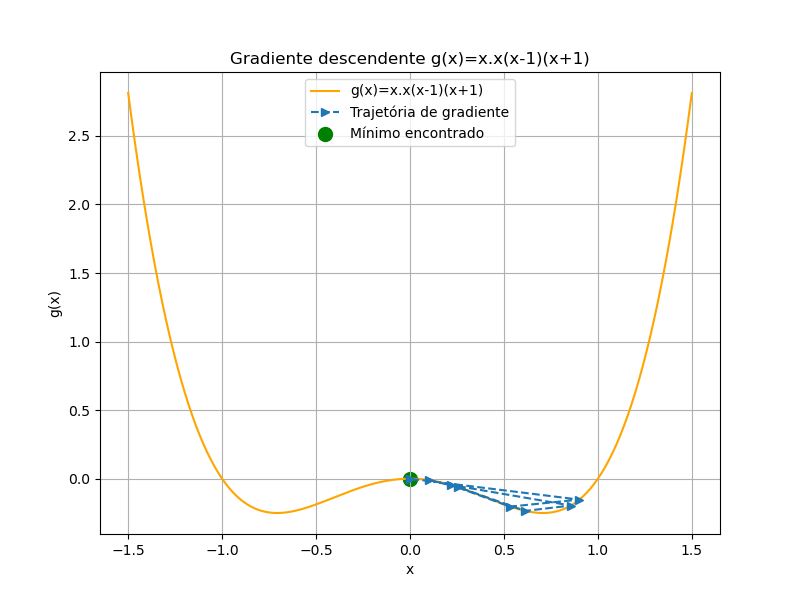

# 📉 Gradiente Descendente

Este repositório apresenta uma implementação simples do algoritmo de **Gradiente Descendente**, um dos métodos de otimização mais utilizados em aprendizado de máquina. A aplicação é feita sobre umas funções quadráticas unidimensional e bidimensional com visualizações gráficas que demonstram a convergência ao mínimo.

---

## 📌 Descrição

O **Gradiente Descendente** é um algoritmo iterativo que ajusta os parâmetros de uma função na direção oposta ao gradiente, com o objetivo de minimizar seu valor. É um componente fundamental de muitos algoritmos de machine learning, como regressão linear, regressão logística e redes neurais.

A equação de atualização do gradiente descendente é:

$$
\theta_{t+1} = \theta_t - \alpha \nabla J(\theta_t)
$$

- $\theta$: parâmetro que queremos otimizar

- $t$: índice da iteração

- $\alpha$: taxa de aprendizado (learning rate)

- $\nabla J(\theta_t)$: gradiente da função de custo $J$ em relação a $\theta$

---

## 📉 Resultados

A função utilizada para teste é uma parábola com mínimo conhecido. O algoritmo foi executado com diferentes taxas de aprendizado, e observou-se que:

- O algoritmo converge ao mínimo em poucas iterações com taxa adequada;
- Taxas muito altas causam oscilações ou divergência;
- Taxas muito baixas tornam a convergência lenta.

---

## 📊 Gráficos incluídos

Os seguintes gráficos foram gerados e estão disponíveis na pasta `image1/`:

- **Gráfico de convergência questão 1**  
  Mostra como o valor de `x` se aproxima do mínimo ao longo das iterações com taxa de aprendizado $\alpha=0.2$.  
  

  Além disso, mostra o caminho percorrido pelo algoritmo sobre a curva da função para uma taxa de aprendizado maior ($\alpha=0.9$) tem uma convergência oscilante.  
  

---
- **Gráfico de convergência de questão 2**
Na seguinte figura mostra-se a convergência devagar

---
