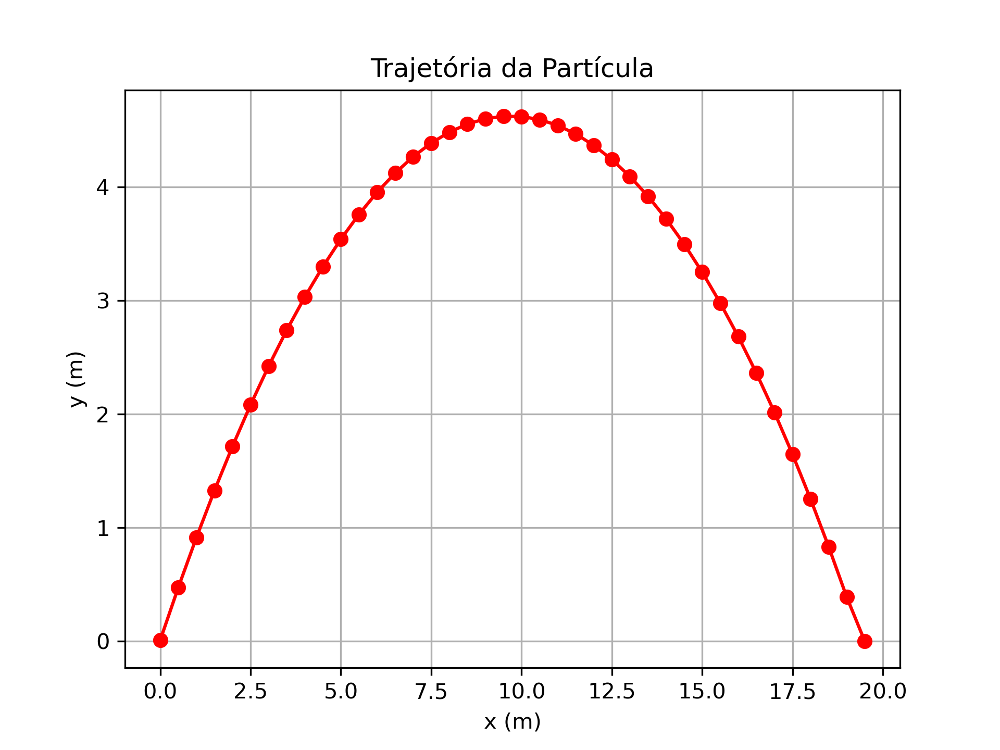

## 💡 Programação Orientada a Objetos aplicada ao Movimento Parabólico

Este projeto implementa a **simulação do movimento parabólico** utilizando os princípios da **programação orientada a objetos (POO)** em Python. A abordagem modular e orientada a objetos facilita a organização do código, a reutilização de componentes e a expansão futura para simulações mais complexas.

### 🧱 Estrutura orientada a objetos

- **Classe `particula`**: representa um objeto na origem de coordenadas, lançado com uma força inicial. Contém atributos como:
  - `posicao(t)` – retorna as coordenadas (x, y) no instante `t`
  - `F0` (forçã inicial) da forma `(0,fy)`
  - `g` (aceleração da gravidade)
   -`massa` – massa
  
   Métodos 
  - `_init_(self,x,y,v_x,v_y, massa)`:- construtor da classe que inicializa os atributos da partícula.
  - `newton(self,f_x,f_y,dt)` – : aplica a segunda lei de Newton para atualizar a velocidade e a posição da partícula com base nas forças (fx, fy) aplicadas e no intervalo de tempo `dt`

### ⚙️ Funcionalidades

- Calcula as posições ao longo da trajetória até cair no solo
- Geração de gráficos da trajetória
- Fácil modificação de parâmetros físicos (Posição, força, massa, etc.)

### 📉 Resultados
Usando [ejemplo01.py](ejemplo01.py) e classe [particula.py](particula.py) obtem-se a seguinte figura.  

 > Trajetória oblíquo de um corpo

### 🚀 Objetivo educacional

Este projeto serve como exemplo prático de como aplicar os conceitos de POO (como encapsulamento, abstração e reutilização) à modelagem de fenômenos físicos clássicos. É ideal para estudantes de Física, Engenharia ou Ciência da Computação.
