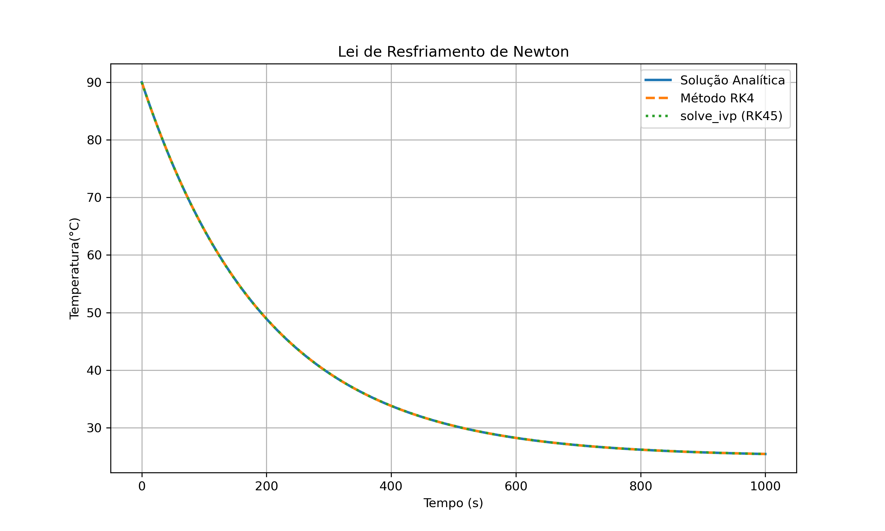
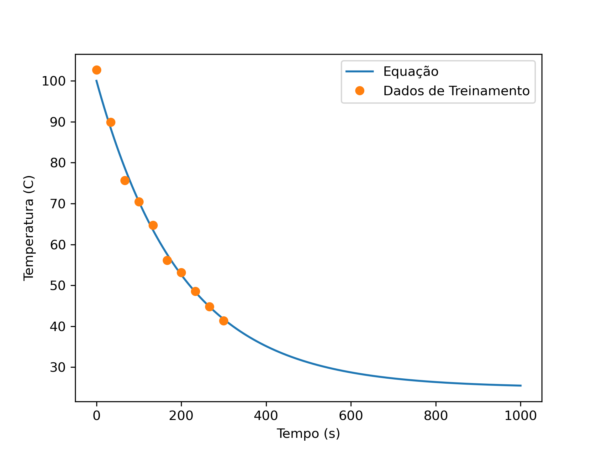
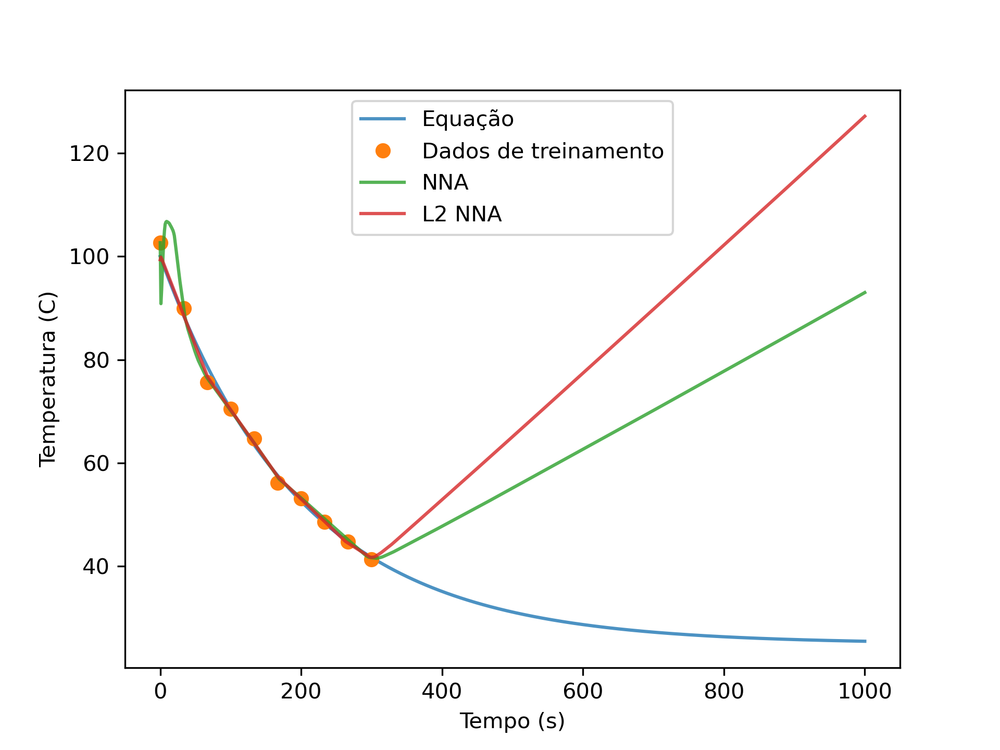
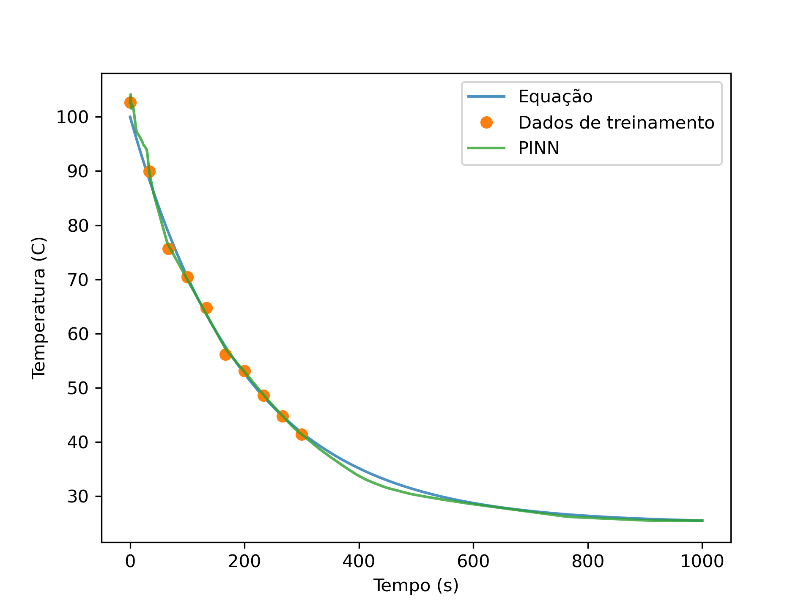
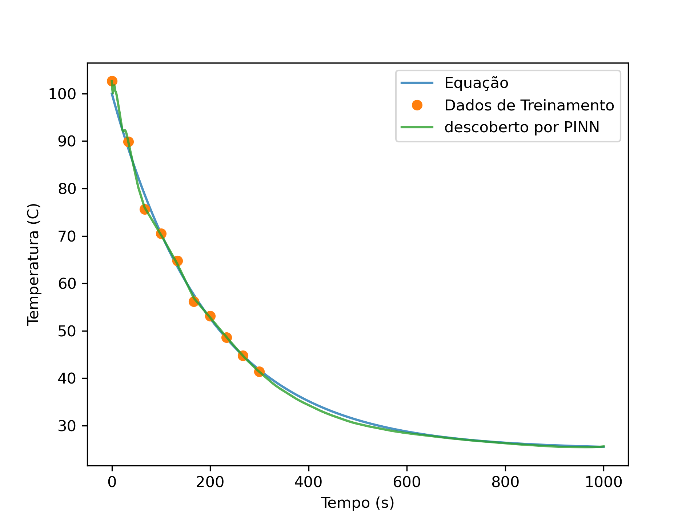

# 📘 Physics-Informed Neural Networks (PINNs)

As **PINNs** (Physics-Informed Neural Networks) são redes neurais que incorporam o conhecimento das **leis físicas**, tipicamente expressas por **equações diferenciais**, diretamente na função de perda. Essa técnica combina **dados observacionais** com **modelos matemáticos**, permitindo resolver problemas físicos de forma precisa mesmo com dados escassos ou ruidosos.

---

## 🎯 Objetivo

A ideia principal é treinar uma rede neural $\hat{u}(x,t;\theta)$ que satisfaça:
- as condições de contorno/iniciais,
- os dados observados (se houver),
- e, principalmente, a **equação diferencial** que governa o fenômeno.

---

## ⚙️ Formulação Matemática

### 🧩 Defina uma Equação diferencial ordinaria ou Parcial

$
\frac{\partial u}{\partial t} = \nu \frac{\partial^2 u}{\partial x^2}, \quad x \in \Omega, \ t \in [0,T]$

### 🔧 Rede neural

A rede  $\hat{u}(x,t;\theta)$ é otimizada minimizando a **função de perda total**:

$
\mathcal{L} = \mathcal{L}_{\text{data}} + \lambda \mathcal{L}_{\text{physics}}
$

#### 🎯 Termos da perda:
- **Erro nos dados** (se houver):
  $
  \mathcal{L}_{\text{data}} = \frac{1}{N_d} \sum_{i=1}^{N_d} |\hat{u}(x_i,t_i) - u_i^{\text{obs}}|^2
  $
- **Erro físico** (resíduo da EDP):
  $
  \mathcal{L}_{\text{physics}} = \frac{1}{N_f} \sum_{j=1}^{N_f} \left| \frac{\partial \hat{u}}{\partial t}(x_j,t_j) - \nu \frac{\partial^2 \hat{u}}{\partial x^2}(x_j,t_j) \right|^2
  $

---

## 🏗️ Pipeline de Implementação

1. **Definir a EDP** (calor, Burgers, onda, difusão,etc.)
2. **Construir a rede neural** (MLP com ativação não-linear)
3. **Usar autograd** para obter derivadas necessárias
4. **Definir pontos de colocation** (malha no domínio espaço-tempo)
5. **Treinar** com otimizadores como Adam ou L-BFGS

---

## 📊 Resultados

### ❄️ Equação de resfriamento de Newton

$\frac{dT}{dt}=-k(T-T_a)$

A solução analítica é:

$ T(t)=T_a+(T_0-T_a)e^{-kt}$, onde $T_a$: a temperatura de ambiente e $T_0$: a temperatura inicial.

A solução particular para $T_a=25°C$ e $T_0=95°C$: 

 $T(t)=25+70e^{-0.005t}$

> Comparação entre a solução analítica, método Runge-Kutta e RK45.

---

### 📊 Geração de Dados de Treinamento

> Solução analítica e geração de 10 dados com ruído Gaussiano para treinamento.

---

### Ajuste dos dados com NN regressão simples

> Solução analítica, dados de treinamento e regressão simples
---

### Implementação de PINNs

> Solução analítica e predição usando o PINNs

---

### Predição de constante k usando PINNs

> Determinação do valor de constante de resfriamento usando os dados de treinamento. 

---

## 📚 Referências

- Raissi, M., Perdikaris, P., & Karniadakis, G. E. (2019).  
  *Physics-informed neural networks: A deep learning framework for solving forward and inverse problems involving nonlinear partial differential equations*.  
  Journal of Computational Physics, 378, 686–707.  
  [DOI:10.1016/j.jcp.2018.10.045](https://doi.org/10.1016/j.jcp.2018.10.045)

---
